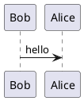
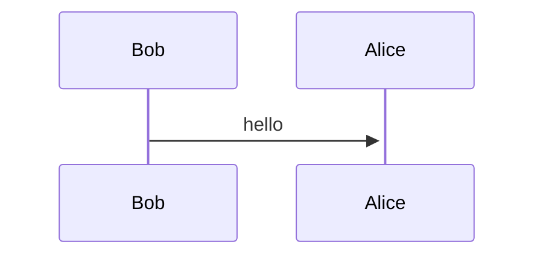

## Considerations for graphs in GitHub Pages' Jekyll

I've contemplated creating a technical blog for years and finally decided that I would do it two weeks ago. Due to the fact that I already used it for other projects, the absence of need for a hosting plan, and the ease of the transition to a self-hosted website should I elect to do so, I created it as a [Jekyll site on GitHub Pages](https://docs.github.com/en/pages/setting-up-a-github-pages-site-with-jekyll/about-github-pages-and-jekyll). The only issue was the generation of graphs, which are numerous in technical posts, as I wanted to easily see what they contained and be able to update them from the command-line, thus making raw images unsuitable.

## The PlantUML alternative

The graph generation tool I often use in projects is [PlantUML](https://plantuml.com/), a well-known server-side graph generation tool with integrations in most markup languages and tools. If you're interested in it, you may want to play with the [live online editor](https://www.plantuml.com/plantuml/uml/7Sp13G8X40NG-rJnRq8BUbbRa0f4_yP94CpE44BtahszqzlCduVtRv4JeZl2VRR1SZ4CPbDdX7zO4IOj2d1DFTlhq4myKhe9Yn6XjYYiRzrNr7woBQ_r3m00). Here is a quick example where Bob says "hello" to Alice:




Adding PlantUML support to [Jekyll](https://jekyllrb.com/) is pretty easy on administered servers thanks to the [jekyll-plantuml](https://rubygems.org/gems/jekyll-plantuml/) rubygem, which may be added as a dependency, however this gem is not part of the [gem whitelist](https://pages.github.com/versions/) that may be used on GitHub Pages Jekyll servers. Additionally, the use of the online editor to generate images on-the-fly requires to encode the source in base-64, which is not possible on-the-fly without using Jekyll plugins.

An option might have been to statically encode the source graph and use the online editor to generate the images. An implementation of this setup for GitHub pages would consist in the creation of a file named `_includes/plantuml.html` that would be included with the base-64 encoded version of the graph to display everywhere a graph was needed. The most obvious limitation of this method is that it makes the graph unreadable in Markdown[^1]. The following is an example where the PlantUML code example above would be included in a page:


```html
<!-- _includes/plantuml.html -->

```



```md
Here is a quick example of the format where Bob says "hello" to Alice:

```


This last option worked, but was unsatisfactory and I looked for an other way to support graphs.

[^1]: It also makes the graph a pain to maintain as an external editor is required to know what changed if anything did, and binds the validity of a graph to the implementation provided by an uncontrolled server which may introduce breaking format changes someday.

## The Mermaid alternative

I recently discovered [Mermaid](https://mermaid.js.org/), a well-known client-side graph generation tool with integrations in most markup languages and tools. If you're interested in it, you may want to play with the [live online editor](https://mermaid.live/edit#pako:eNptkE0KwjAQha8yzEaQduMylILgCezSiKTp1AZtIklqKcW7m9o_BbOaee_LzGN6lKYgZMi188LTQYmrFXX83HEN4X1EUOVlLJJEVkZJStNvm2PW5E5alRMcs4wjCAduln7JfWdaum8ctJQ75WmE50aP8Gl7hjhOV3kQp-ZjzIFGZ4k3WMteBh25afkSbyDC9D__gspAG64xwppsLVQRztIPJEdfUR2islAWwt54ONcrcKLxJuu0ROZtQxE2j2K9IbJS3B293jObdFE). Here is a quick example where Bob says "hello" to Alice:




Much like PlantUML, Mermaid integration in Jekyll on administered servers is pretty easy thank to rubygems (see [jekyll-mermaid](https://rubygems.org/gems/jekyll-mermaid) or [jekyll-mermaid-diagrams](https://rubygems.org/gems/jekyll-mermaid-diagrams)). Much like PlantUML, none of Mermaid's rubygem are part of the GitHub Pages [gem whitelist](https://pages.github.com/versions/), hence another way to use it is required.

The most straightforward way to add Mermaid to Jekyll without using plugins is to replicate what plugins do: load the mermaid JavaScript[^2] and encapsulate the mermaid code in a HTML element with the class `mermaid`[^3].

[^2]: Plugins do it wherever a mermaid graph is used in a document's body, and I do the same at the time of writing, however loading it in the header in a layout file is also an option.
[^3]: Mermaid automatically scans a document and looks for elements with the `mermaid` class to generate the matching graphs when it is loaded.

### How I integrated mermaid

To add support for Mermaid, I created the following include file:


```html
<!-- _includes/mermaid.html -->
<script async src="{{ site.mermaid.src }}"></script>
<div class="mermaid">
{{ include.source | xml_escape }}
</div>
```


This file is heavily based on the code you may find in plugins. Still, there are a few things to note:

* `site.mermaid.src`: This is the same configuration variable used by the plugins to locate the mermaid JavaScript file. It is set in the server's `_config.xml` as `mermaid.src`[^4].
* `<script async ...>`: Plugins do not load the JavaScript file asynchronously to ensure that the graphs are fully generated before displaying the page. This means that the page is still loading for up to seconds when the mermaid JS is not cached in the browser. I elected to show the page before its content is turned into a graph.
* `include.source | xml_escape`: The `include.source` is the content of the graph that should be interpreted by Mermaid, `xml_escape` is used to ensure that when `<` or `>` is used in the graph's definition.

Using this include file works as follows:


sequenceDiagram
    Bob->>+Alice: hello


```md

{{ demo_diagram }}


```

One important 'detail' is the use of the `capture` tag, which allows to store a multiline string in a variable. Jekyll plugins use custom tags to accomodate the multiline configuration of graphs ; 
this is not possible when using `include`, hence the use of an intermediate capture tag. 

And here is the result:



[^4]: At the time of writing, the file loaded is the [version 9.3.0](https://unpkg.com/mermaid@9.3.0/dist/mermaid.min.js) of mermaid available on the Mermaid CDN.

## Afterword

I'm pretty happy with how mermaid can work in the browser even in a restricted environment such as GitHub Pages. I'm a bit annoyed by the fact that I will have to use a `capture` tag each time I want to insert a graph, but that's an acceptable limitation to me.
